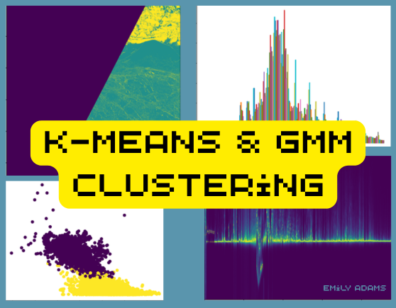

<a id="readme-top"></a>

<!-- PROJECT LOGO -->
<br />
<div align="center">
  <a href="https://github.com/eemeleems/GEOL0069_W4_unsupervised">
    
  </a>

<h3 align="center">Sea Ice and Lead Unsupervised Classification</h3>

  <p align="center">
  <strong>GEOL0069 (AI4EO) - Week 4 | UCL Earth Sciences</strong>
    <br />
  Distinguishing sea ice from leads using K-Means, GMM, and AWI-style radar alignment
  <br/>
    <a href="https://github.com/eemeleems/GEOL0069_W4_unsupervised"><strong>Explore the docs »</strong></a>
    <br />
    <br />
 
  </p>
</div>


<!-- TABLE OF CONTENTS -->
<details>
  <summary>Table of Contents</summary>
  <ol>
    <li>
      <a href="#project-summary">Project Summary</a>
      <ul>
        <li><a href="#sentinel-2-and-sentinel-3-data">Sentinel-2 & Sentinel-3 Data</a></li>
        <li><a href="#unsupervised-learning-models">Unsupervised Learning Models</a></li>
        <li><a href="#k-means-clustering">K-Means Clustering</a></li>
        <li><a href="#gaussian-mixture-models">Gaussian Mixture Models (GMM)</a></li>
        <li><a href="#avi-alignment">AVI Alignment</a></li>
      </ul>
    </li>
    <li>
      <a href="#getting-started">Getting Started</a>
      <ul>
        <li><a href="#prerequisites-installation">Prerequisites & Installation</a></li>
      </ul>
    </li>
    <li><a href="#contact">Contact</a></li>
    <li><a href="#acknowledgments">Acknowledgments</a></li>
  </ol>
</details>


<!-- ABOUT THE PROJECT -->
# Project Summary

As polar regions experience rapid climate shifts, it is important to monitor the distribution of sea ice (frozen sea water floating on the ocean surface) and leads (linear fractures in the sea ice), to understand ocean-atmosphere heat exchange and safe ship navigation. Image processing is crucial to appropriately classify these two features, and this can be done using unsupervised machine learning.

This project covers two unsupervised machine learning algorithms to differentiate sea ice and leads in satellite images. We use Sentinel-2 optical (OLCI) and Sentinel-3 altimetry (SRAL) data to classify them, and compare this with ground truth data from the European Space Agency (ESA). 

<p align="right">(<a href="#readme-top">back to top</a>)</p>

## Sentinel-2 and Sentinel-3 Data

Sentinel-2 and Sentinel-3 are both observation missions from the European Space Agency (ESA) Copernicus Programme. We use both optical data and radar altimetry data as a multi-sensor approach to extend classification capabilities and improve reliability, such as where optical data experiences cloud cover.

Read more about the missions here: [Sentinel-2](https://dataspace.copernicus.eu/data-collections/copernicus-sentinel-missions/sentinel-2) & [Sentinel-3](https://dataspace.copernicus.eu/explore-data/data-collections/sentinel-data/sentinel-3)

<br/>


## Unsupervised Learning Models

Unsupervised learning is a type of artificial intelligence in which models work without pre-defined labels (dataset is not classified under human supervision). Unlike supervised learning, unsupervised learning models are given unlabelled data and find patterns by grouping similar data points and finding hidden structures. 

These algorithms are most appropriate for complex tasks like organising large datasets into clusters. There are a number of different clustering types, including exclusive ('hard'), overlapping ('soft'), hierarchical, and probabilistic.

<br/>

**There are many unsupervised learning algorithms, and today we are looking at two of them:**

* K-Means Clustering (Exclusive Clustering)
* Gaussian Mixture Models (GMM) (Probabilistic Clustering)

<br/>

### K-Means Clustering
K-means clustering is a centroid-based algorithm that splits the data into k clusters (or groups) by minimising the within-cluster sum of squares (inertia), where k represents the number of groups pre-specified by the analyst. The algorithm defines k centroids, one for each cluster, and then each data point is assigned to the nearest centroid, whilst keeping the centroids as small as possible.

<br/>

**K-means clustering is particularly well-suited for applications where:**

* The structure of the data is not known beforehand: K-means doesn’t require any prior knowledge about the data distribution or structure, making it ideal for exploratory data analysis.
* Simplicity and scalability: The algorithm is straightforward to implement and can scale to large datasets relatively easily.

<br/>

**Components of K-Means:**

* Choosing K: The number of clusters (k) is a parameter that needs to be specified before applying the algorithm.
* Centroids Initialisation: The initial placement of the centroids can affect the final results.
* Assignment Step: Each data point is assigned to its nearest centroid, based on the squared Euclidean distance.
* Update Step: The centroids are recomputed as the center of all the data points assigned to the respective cluster.

The assignment and update steps are repeated iteratively until the centroids no longer move significantly, meaning the within-cluster variation is minimised. This iterative process ensures that the algorithm converges to a result, which might be a local optimum.

<br/>

**Advantages of K-Means:**

* Efficiency: K-means is computationally efficient.
* Ease of interpretation: The results of k-means clustering are easy to understand and interpret.

<p align="right">(<a href="#readme-top">back to top</a>)</p>

### Gaussian Mixture Models (GMM)
Gaussian Mixture Models (GMM) are a probabilistic model that assumes data is generated from a mixture of several Gaussian distributions with unknown parameters, each with its own mean and variance. It assumes normally distributed subpopulations within an overall population. GMMs are widely used for clustering and density estimation, as they provide a method for representing complex distributions through the combination of simpler ones.

<br/>

**Gaussian Mixture Models are particularly powerful in scenarios where:**

* Soft clustering is needed: Unlike K-means, GMM provides the probability of each data point belonging to each cluster, offering a soft classification and understanding of the uncertainties in our data.
* Flexibility in cluster covariance: GMM allows for clusters to have different sizes and different shapes, making it more flexible to capture the true variance in the data.

<br/>

**Key Components of GMM:**

* Number of Components (Gaussians): Similar to K in K-means, the number of Gaussians (components) is a parameter that needs to be set.
* Expectation-Maximization (EM) Algorithm: GMMs use the EM algorithm for fitting, iteratively improving the likelihood of the data given the model.
* Covariance Type: The shape, size, and orientation of the clusters are determined by the covariance type of the Gaussians (e.g., spherical, diagonal, tied, or full covariance).

<br/>

**The Expectation-Maximization (EM) algorithm is a two-step process:**

* Expectation Step (E-step): Calculate the probability that each data point belongs to each cluster.
* Maximization Step (M-step): Update the parameters of the Gaussians (mean, covariance, and mixing coefficient) to maximize the likelihood of the data given these assignments.
This process is repeated until convergence, meaning the parameters do not significantly change from one iteration to the next.

<br/>

**Advantages of GMM:**

* Soft Clustering: Provides a probabilistic framework for soft clustering, giving more information about the uncertainties in the data assignments.
* Cluster Shape Flexibility: Can adapt to ellipsoidal cluster shapes, thanks to the flexible covariance structure.

<p align="right">(<a href="#readme-top">back to top</a>)</p>

### AWI Alignment

Radar altimetry is sensitive to orbital tracker inaccuracies and Mean Sea Surface (MSS) variations. To extract meaningful features and increase reliability, we implement a sub-pixel waveform alignment, with the methodology produced by the Alfred Wegener Institute (AWI).

Using FFT (Fast Fourier Transform) Oversampling, we realign the echoes to a common reference. This process reduces noise in the Peakiness and SSD calculations, significantly increasing the separation between the "Ice" and "Lead" clusters in the feature space.

<p align="right">(<a href="#readme-top">back to top</a>)</p>

<!-- GETTING STARTED -->
# Getting Started

This project is designed to be run in Google Colab, which is a free cloud-based platform for writing, running, and sharing Python code collaboratively. This platform allows access to RAM and computing power needed to process large NetCDF and Raster (satellite) data. Google Colab integrates well with Google Drive. However, it is also possible to run this code in a local environment, bearing in mind that you must map your local paths, rather than Google Drive paths, to access the Copernicus Sentinel files. To access the notebook, click the Google Colab link in the ipynb file included in this repository.

<p align="right">(<a href="#readme-top">back to top</a>)</p>

## Prerequisites & Installation

Code for the installation of packages & libraries is also included in the .ipynb document.

**Necessary Packages for this Project:**
   
```sh
!pip install rasterio
!pip install netCDF4
```
<br/>

**Python & Machine Learning Libraries:**

```sh
import rasterio
import numpy as np
import matplotlib.pyplot as plt
from netCDF4 import Dataset
from scipy.interpolate import interp1d
from scipy.optimize import curve_fit

from sklearn.cluster import KMeans
from sklearn.mixture import GaussianMixture
from sklearn.preprocessing import StandardScaler
from sklearn.metrics import confusion_matrix, ConfusionMatrixDisplay, classification_report
from numpy import asarray as ar, exp
````

<br/>

The Optical (Sentinel-2) and Altimetry (Sentinel-3) data were accessed using the [Copernicus Data Store](https://cds.climate.copernicus.eu/). To access these data, you must set up a login for the Copernicus data store, and use this when required in your code.

Before completing the notebook provided in this repository, please extract and colocate the Sentinel-3 and Sentinel-2 data following the steps provided in [Colocating Sentinel Data](https://cpomucl.github.io/GEOL0069-AI4EO/Chapter1_Data_Colocating_S2_S3_3.html).

**Names of the Sentinel 2 and Sentinel-3 data folders used within this project:**

* Sentinel-2 optical data : S2A_MSIL1C_20190301T235611_N0207_R116_T01WCU_20190302T014622.SAFE

* Sentinel-3 OLCI data : S3B_SR_2_LAN_SI_20190301T231304_20190301T233006_20230405T162425_1021_022_301______LN3_R_NT_005.SEN3

<p align="right">(<a href="#readme-top">back to top</a>)</p>

<!-- CONTACT -->
# Contact
Emily Grace Adams - [LinkedIn](https://www.linkedin.com/in/emily-grace-adams/) - emily.adams.25@ucl.ac.uk

Project Link: [https://github.com/eemeleems/GEOL0069_W4_unsupervised](https://github.com/eemeleems/GEOL0069_W4_unsupervised)

<p align="right">(<a href="#readme-top">back to top</a>)</p>


<!-- ACKNOWLEDGMENTS -->
# Acknowledgments

* This project makes up my Week 4 assignment for GEOL0069 Artificial Intelligence for Earth Observation (25/26) at University College London.
* Thank you to [Prof. Michel Tsamados](https://profiles.ucl.ac.uk/11855-michel-tsamados) and [Weibin Chen](https://www.ucl.ac.uk/mathematical-physical-sciences/weibin-chen) for producing the initial Jupyter Notebook for this project and their guidance in AI for Earth Observation.
* Thank you to [ESA/Copernicus](https://cds.climate.copernicus.eu/) for the availability of Sentinel-2 and Sentinel-3 data.
* Thank you to [AWI (Alfred Wegner Institute)](https://www.awi.de/en/) for the methodology regarding radar re-tracking.


<p align="right">(<a href="#readme-top">back to top</a>)</p>

